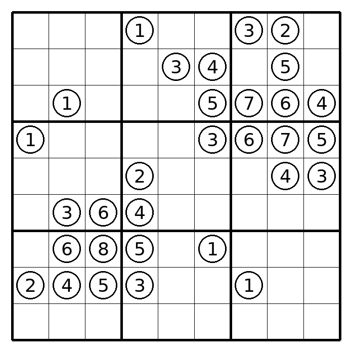
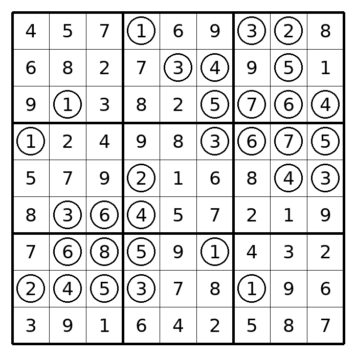

# Ghosts, all visible: a unique 31-ghost grid with an 8 [verified]

Target (Chris, 2026-09-15): every ghost is visible and shows its digit; those
digits are the only givens and make the sudoku unique; one ghost holds 8.
A shape fixes its givens (each ghost shows its ghost-neighbour count), so this
is a search over ghost shapes.

## Result

`docs/research/ghosts/allvisible-hits.jsonl` line 0: 31 ghosts, one 8 (r7c3).
`uv run --with pillow docs/research/ghosts/check_hit.py docs/research/ghosts/allvisible-hits.jsonl 0 sol.png puz.png`
recomputes the counts, checks the 8, and has CP-SAT (all-different model, no
code shared with the finder) enumerate solutions: exactly 1.

Puzzle: 
Solution: 

Not minimised: 31 is the first hit, not the fewest ghosts.

## What worked and what did not

| approach | outcome |
|---|---|
| fix a random grid, CEGAR on shape (`allvisible.py` @ abccd56) | a grid admits only 1-13 shapes (3 grids sampled); master infeasible after 1 cut |
| joint grid+shape CEGAR (`allvisible.py`) with relabeling cuts and static unavoidable-set clauses (deadly rectangles, two-line cycles, band hexagons, band 3-cycles) | ~7 s per master solve; 41-63 cuts in 5 min, no unique; counterexamples stay 6-8 cells |
| shape hill climb, cap-200 counter, single toggles, 20+ ghost seeds (`shapes.py`) | best 22 solutions in 2 min |
| same, annealed from T=1, cap 2000 | worse: all 2000+ |
| same, T=0.1, toggle one cell or a cell plus a neighbour, 26+ ghost seeds | **hit in 165 s** (seed 3, climb 5); other climbs 13-980 |

Shape search wins because a uniqueness check on a fixed set of givens is a
millisecond bitmask count, while the CEGAR master re-solves a large CP-SAT
model per cut. Seeds come from the grid+ghost CP-SAT model so every seed is
solvable.

Run: `uv run docs/research/ghosts/shapes.py --seconds 240 --climb-seconds 40 --min-ghosts 26 --seed 3 --out DIR`

## Next

- Minimise the ghost count: climb with the score (solutions, ghosts) and accept
  removals that keep 1 solution.
- Rate-of-hits over more seeds, then decide whether the finder moves to
  `finders/` through the code lane.

## Dense shapes from CP-SAT (`dense.py`, 2026-09-15)

Maximise the ghost count in the grid+ghost model (10 s per solve, one worker,
random digit hints), check with the counter, cut the second solution, re-solve
up to 5 rounds per model. 300 s, seed 1: **30 solves, 0 unique.** Ghost counts
reached 27-33 (never proven optimal), second solutions differed in 4-30 cells.
The solver does not reach the 36+ ghosts the idea needs within 10 s; whether
such shapes exist at all is untested. Box load average was 5-6 during the run.
