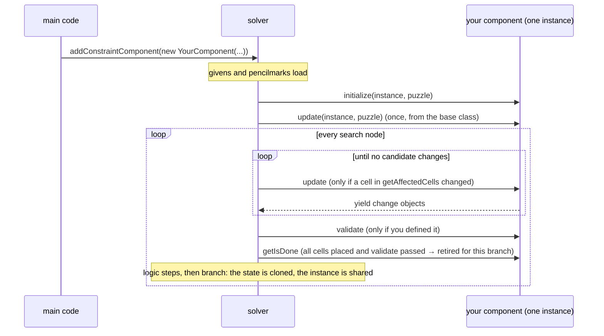

## Guide: writing a custom constraint

A custom constraint is two kinds of code segment. Main code runs once, when
the solver is set up: it reads the puzzle and registers component instances.
Component code is a class the solver calls during the search: it reads
candidates and yields deductions. The reference below is organised around that
split. Each fact in this guide comes from a reference entry, and the links go
there.

### 1. Where your code runs

Main code receives `puzzle`, `input` and `helpers` as plain names in scope.
`puzzle` is a [PuzzleSetupView](#puzzlesetupview). It can read the board
geometry and register or remove components; it cannot read candidates. The
component segment defines up to five free functions, and
[compileCustomComponentClass](#how-your-code-becomes-a-class-compilecustomcomponentclass)
copies them onto a class for you:

```js
// component segment: five free functions the app looks up by name
function getAffectedCells (cells, target) { return cells } // -> instance.cellIds; runs before `this` exists
function setParams (instance, cells, target) { instance.target = target } // the only route from arguments to fields
function * initialize (instance, puzzle) { }  // once, before the first search node; then update runs once
function * update (instance, puzzle) { }      // whenever one of getAffectedCells' cells changes
function validate (instance, puzzle) { return true } // a boolean; defining it turns per-node checking on
```

Inside those functions `puzzle` is a different object, a
[SolverPuzzleView](#solverpuzzleview): it reads the live search node and builds
change objects. Neither `input` nor the setup `puzzle` is in scope there.

There are also two `helpers` objects. Main code gets the extended one with
`lines`, `misc` and a region-aware `geometry`; component functions get the base
one without them. The [table under Shared reads](#puzzleaccessorbase) says which
members each has.

Main code fails open. A throw in the backend segment, or a compile error in a
component, is logged and the puzzle solves as if the constraint did not exist
([registerCustomConstraint](#how-your-code-becomes-a-class-registercustomconstraint)).
A throw inside `update` is silent apart from the console: the generator ends,
no deduction is made, and the solve continues.

### 2. Reading the grid

Cell ids are integers, `x + y * width`, 0-based. Every read on the solver view
goes straight to the search node's cells:

| You want | Call | Returns |
|-|-|-|
| the placed digit | [getValue](#solverpuzzleview-getvalue) | digit or `undefined` |
| whether a cell is placed | [hasValue](#solverpuzzleview-hasvalue) | boolean |
| remaining candidates as a set | [getCandidates](#solverpuzzleview-getcandidates) | a fresh `SudokuDigitSet` |
| remaining candidates as bits | [getCandidatesBitMask](#solverpuzzleview-getcandidatesbitmask) | number, bit `d` is digit `d` |
| cells that must differ from one cell | [getCellsSeenByCell](#puzzleaccessorbase-getcellsseenbycell) | a fresh `Set` |
| whether cells are pairwise distinct | [getCellsSeeEachOther](#puzzleaccessorbase-getcellsseeeachother) | boolean |

<figure class="fig"><svg viewBox="0 0 560 118" width="560" role="img" aria-label="A candidate bitmask: bit d is digit d, and bit 0 is never used on a 1-based grid." style="max-width:100%;height:auto;font-family:var(--vt-ui-font);font-size:11px"><text x="14" y="20" text-anchor="end" dominant-baseline="middle" fill="var(--vt-muted)" font-size="10" font-family="var(--vt-ui-font)" font-weight="normal">bit</text><text x="42.0" y="20" text-anchor="middle" dominant-baseline="middle" fill="var(--vt-muted)" font-size="10" font-family="var(--vt-mono-font)" font-weight="normal">9</text><rect x="20" y="30" width="40" height="34" rx="4" fill="var(--vt-paper)" stroke="var(--vt-rule)"/><text x="40.0" y="47" text-anchor="middle" dominant-baseline="middle" fill="var(--vt-muted)" font-size="15" font-family="var(--vt-mono-font)" font-weight="normal">0</text><text x="40.0" y="78" text-anchor="middle" dominant-baseline="middle" fill="var(--vt-muted)" font-size="9" font-family="var(--vt-ui-font)" font-weight="normal"></text><text x="86.0" y="20" text-anchor="middle" dominant-baseline="middle" fill="var(--vt-muted)" font-size="10" font-family="var(--vt-mono-font)" font-weight="normal">8</text><rect x="64" y="30" width="40" height="34" rx="4" fill="var(--vt-paper)" stroke="var(--vt-rule)"/><text x="84.0" y="47" text-anchor="middle" dominant-baseline="middle" fill="var(--vt-muted)" font-size="15" font-family="var(--vt-mono-font)" font-weight="normal">0</text><text x="84.0" y="78" text-anchor="middle" dominant-baseline="middle" fill="var(--vt-muted)" font-size="9" font-family="var(--vt-ui-font)" font-weight="normal"></text><text x="130.0" y="20" text-anchor="middle" dominant-baseline="middle" fill="var(--vt-muted)" font-size="10" font-family="var(--vt-mono-font)" font-weight="normal">7</text><rect x="108" y="30" width="40" height="34" rx="4" fill="var(--vt-paper)" stroke="var(--vt-rule)"/><text x="128.0" y="47" text-anchor="middle" dominant-baseline="middle" fill="var(--vt-muted)" font-size="15" font-family="var(--vt-mono-font)" font-weight="normal">0</text><text x="128.0" y="78" text-anchor="middle" dominant-baseline="middle" fill="var(--vt-muted)" font-size="9" font-family="var(--vt-ui-font)" font-weight="normal"></text><text x="174.0" y="20" text-anchor="middle" dominant-baseline="middle" fill="var(--vt-muted)" font-size="10" font-family="var(--vt-mono-font)" font-weight="normal">6</text><rect x="152" y="30" width="40" height="34" rx="4" fill="var(--vt-paper)" stroke="var(--vt-rule)"/><text x="172.0" y="47" text-anchor="middle" dominant-baseline="middle" fill="var(--vt-muted)" font-size="15" font-family="var(--vt-mono-font)" font-weight="normal">0</text><text x="172.0" y="78" text-anchor="middle" dominant-baseline="middle" fill="var(--vt-muted)" font-size="9" font-family="var(--vt-ui-font)" font-weight="normal"></text><text x="218.0" y="20" text-anchor="middle" dominant-baseline="middle" fill="var(--vt-muted)" font-size="10" font-family="var(--vt-mono-font)" font-weight="normal">5</text><rect x="196" y="30" width="40" height="34" rx="4" fill="var(--vt-accent-soft)" stroke="var(--vt-accent)"/><text x="216.0" y="47" text-anchor="middle" dominant-baseline="middle" fill="var(--vt-accent)" font-size="15" font-family="var(--vt-mono-font)" font-weight="600">1</text><text x="216.0" y="78" text-anchor="middle" dominant-baseline="middle" fill="var(--vt-accent)" font-size="9" font-family="var(--vt-ui-font)" font-weight="normal">digit 5</text><text x="262.0" y="20" text-anchor="middle" dominant-baseline="middle" fill="var(--vt-muted)" font-size="10" font-family="var(--vt-mono-font)" font-weight="normal">4</text><rect x="240" y="30" width="40" height="34" rx="4" fill="var(--vt-paper)" stroke="var(--vt-rule)"/><text x="260.0" y="47" text-anchor="middle" dominant-baseline="middle" fill="var(--vt-muted)" font-size="15" font-family="var(--vt-mono-font)" font-weight="normal">0</text><text x="260.0" y="78" text-anchor="middle" dominant-baseline="middle" fill="var(--vt-muted)" font-size="9" font-family="var(--vt-ui-font)" font-weight="normal"></text><text x="306.0" y="20" text-anchor="middle" dominant-baseline="middle" fill="var(--vt-muted)" font-size="10" font-family="var(--vt-mono-font)" font-weight="normal">3</text><rect x="284" y="30" width="40" height="34" rx="4" fill="var(--vt-accent-soft)" stroke="var(--vt-accent)"/><text x="304.0" y="47" text-anchor="middle" dominant-baseline="middle" fill="var(--vt-accent)" font-size="15" font-family="var(--vt-mono-font)" font-weight="600">1</text><text x="304.0" y="78" text-anchor="middle" dominant-baseline="middle" fill="var(--vt-accent)" font-size="9" font-family="var(--vt-ui-font)" font-weight="normal">digit 3</text><text x="350.0" y="20" text-anchor="middle" dominant-baseline="middle" fill="var(--vt-muted)" font-size="10" font-family="var(--vt-mono-font)" font-weight="normal">2</text><rect x="328" y="30" width="40" height="34" rx="4" fill="var(--vt-paper)" stroke="var(--vt-rule)"/><text x="348.0" y="47" text-anchor="middle" dominant-baseline="middle" fill="var(--vt-muted)" font-size="15" font-family="var(--vt-mono-font)" font-weight="normal">0</text><text x="348.0" y="78" text-anchor="middle" dominant-baseline="middle" fill="var(--vt-muted)" font-size="9" font-family="var(--vt-ui-font)" font-weight="normal"></text><text x="394.0" y="20" text-anchor="middle" dominant-baseline="middle" fill="var(--vt-muted)" font-size="10" font-family="var(--vt-mono-font)" font-weight="normal">1</text><rect x="372" y="30" width="40" height="34" rx="4" fill="var(--vt-accent-soft)" stroke="var(--vt-accent)"/><text x="392.0" y="47" text-anchor="middle" dominant-baseline="middle" fill="var(--vt-accent)" font-size="15" font-family="var(--vt-mono-font)" font-weight="600">1</text><text x="392.0" y="78" text-anchor="middle" dominant-baseline="middle" fill="var(--vt-accent)" font-size="9" font-family="var(--vt-ui-font)" font-weight="normal">digit 1</text><text x="438.0" y="20" text-anchor="middle" dominant-baseline="middle" fill="var(--vt-muted)" font-size="10" font-family="var(--vt-mono-font)" font-weight="normal">0</text><rect x="416" y="30" width="40" height="34" rx="4" fill="var(--vt-soft)" stroke="var(--vt-rule)"/><text x="436.0" y="47" text-anchor="middle" dominant-baseline="middle" fill="var(--vt-rule)" font-size="15" font-family="var(--vt-mono-font)" font-weight="normal">0</text><text x="436.0" y="78" text-anchor="middle" dominant-baseline="middle" fill="var(--vt-muted)" font-size="9" font-family="var(--vt-ui-font)" font-weight="normal">unused</text><text x="20" y="102" text-anchor="start" dominant-baseline="middle" fill="var(--vt-ink)" font-size="10" font-family="var(--vt-mono-font)" font-weight="normal">0b0000101010 = 42 is the set {1, 3, 5}. Test a digit with mask & (1 &lt;&lt; d); walk members with m &amp;= m - 1.</text></svg><figcaption>A candidate bitmask: bit d is digit d, and bit 0 is never used on a 1-based grid.</figcaption></figure>

"Seen by" is built at call time from the components registered so far. In main
code that means only the constraints ordered before yours; from `update` every
house is already registered. A custom component never contributes to it, because
[getExclusionGroup](#constraintcomponent-getexclusiongroup) is not one of the
five functions you can define.

Geometry that does not depend on the solve state, such as rows, boxes, neighbours
and knight moves, lives on [helpers.geometry](#regionawaregeometryhelper); id
arithmetic on [helpers.cellIds](#cellids) and its corner, edge and outer-cell
siblings. Almost every geometry member is a generator: spread it before indexing,
and call it again rather than iterate it twice.

### 3. Making a deduction

`update` and `initialize` are generators. They never write to the grid; they
`yield` change objects that the solver applies. The solver view has one method
per change. In every one of them the digit or digit set comes first and the
cell or cells second:

```js
function * update (instance, puzzle) {
  const { cells, target } = instance
  for (const c of cells) {
    if (puzzle.getValue(c) === target) {
      // keep only `target` here, and drop it from every other cell in the set
      yield puzzle.filterCandidatesInCell(1 << target, c)
      yield puzzle.removeCandidateFromCells(target, cells.filter(o => o !== c))
      return
    }
  }
}
```

| To | Yield |
|-|-|
| drop one digit, or a set, from one cell or several | [removeCandidate(s)FromCell(s)](#solverpuzzleview-removecandidatefromcell) |
| keep only these digits | [filterCandidatesInCell(s)](#solverpuzzleview-filtercandidatesincell) |
| declare the branch dead, with a reason | [stop](#solverpuzzleview-stop) |
| replace yourself with a built-in | [replaceComponent](#solverpuzzleview-replacecomponent) |
| retire yourself | [removeComponent](#solverpuzzleview-removecomponent) |

<figure class="fig"><svg viewBox="0 0 760 250" width="760" role="img" aria-label="Every write method builds a plain change object; the digit or mask is always the first argument." style="max-width:100%;height:auto;font-family:var(--vt-ui-font);font-size:11px"><text x="20" y="16" text-anchor="start" dominant-baseline="middle" fill="var(--vt-muted)" font-size="10" font-family="var(--vt-ui-font)" font-weight="normal">you yield puzzle.…</text><text x="340" y="16" text-anchor="start" dominant-baseline="middle" fill="var(--vt-muted)" font-size="10" font-family="var(--vt-ui-font)" font-weight="normal">the solver sees change.type</text><text x="590" y="16" text-anchor="start" dominant-baseline="middle" fill="var(--vt-muted)" font-size="10" font-family="var(--vt-ui-font)" font-weight="normal">fields</text><rect x="14" y="24" width="300" height="24" rx="4" fill="var(--vt-soft)" stroke="var(--vt-rule)"/><text x="20" y="36" text-anchor="start" dominant-baseline="middle" fill="var(--vt-ink)" font-size="10" font-family="var(--vt-mono-font)" font-weight="normal">removeCandidateFromCell(digit, cellId)</text><line x1="316" y1="36" x2="332" y2="36" stroke="var(--vt-accent)" stroke-width="1.5"/><polygon points="332,32 340,36 332,40" fill="var(--vt-accent)"/><text x="346" y="36" text-anchor="start" dominant-baseline="middle" fill="var(--vt-accent)" font-size="10" font-family="var(--vt-mono-font)" font-weight="normal">3  RemoveCandidatesFromCell</text><text x="590" y="36" text-anchor="start" dominant-baseline="middle" fill="var(--vt-muted)" font-size="10" font-family="var(--vt-mono-font)" font-weight="normal">value = 1 &lt;&lt; digit</text><rect x="14" y="54" width="300" height="24" rx="4" fill="var(--vt-soft)" stroke="var(--vt-rule)"/><text x="20" y="66" text-anchor="start" dominant-baseline="middle" fill="var(--vt-ink)" font-size="10" font-family="var(--vt-mono-font)" font-weight="normal">removeCandidatesFromCells(digits, cells)</text><line x1="316" y1="66" x2="332" y2="66" stroke="var(--vt-accent)" stroke-width="1.5"/><polygon points="332,62 340,66 332,70" fill="var(--vt-accent)"/><text x="346" y="66" text-anchor="start" dominant-baseline="middle" fill="var(--vt-accent)" font-size="10" font-family="var(--vt-mono-font)" font-weight="normal">4  RemoveCandidatesFromCells</text><text x="590" y="66" text-anchor="start" dominant-baseline="middle" fill="var(--vt-muted)" font-size="10" font-family="var(--vt-mono-font)" font-weight="normal">value = mask</text><rect x="14" y="84" width="300" height="24" rx="4" fill="var(--vt-soft)" stroke="var(--vt-rule)"/><text x="20" y="96" text-anchor="start" dominant-baseline="middle" fill="var(--vt-ink)" font-size="10" font-family="var(--vt-mono-font)" font-weight="normal">filterCandidatesInCell(digits, cellId)</text><line x1="316" y1="96" x2="332" y2="96" stroke="var(--vt-accent)" stroke-width="1.5"/><polygon points="332,92 340,96 332,100" fill="var(--vt-accent)"/><text x="346" y="96" text-anchor="start" dominant-baseline="middle" fill="var(--vt-accent)" font-size="10" font-family="var(--vt-mono-font)" font-weight="normal">1  FilterCandidatesAtCell</text><text x="590" y="96" text-anchor="start" dominant-baseline="middle" fill="var(--vt-muted)" font-size="10" font-family="var(--vt-mono-font)" font-weight="normal">value = mask to keep</text><rect x="14" y="114" width="300" height="24" rx="4" fill="var(--vt-soft)" stroke="var(--vt-rule)"/><text x="20" y="126" text-anchor="start" dominant-baseline="middle" fill="var(--vt-ink)" font-size="10" font-family="var(--vt-mono-font)" font-weight="normal">filterCandidatesInCells(digits, cells)</text><line x1="316" y1="126" x2="332" y2="126" stroke="var(--vt-accent)" stroke-width="1.5"/><polygon points="332,122 340,126 332,130" fill="var(--vt-accent)"/><text x="346" y="126" text-anchor="start" dominant-baseline="middle" fill="var(--vt-accent)" font-size="10" font-family="var(--vt-mono-font)" font-weight="normal">2  FilterCandidatesAtCells</text><text x="590" y="126" text-anchor="start" dominant-baseline="middle" fill="var(--vt-muted)" font-size="10" font-family="var(--vt-mono-font)" font-weight="normal">value = mask to keep</text><rect x="14" y="144" width="300" height="24" rx="4" fill="var(--vt-soft)" stroke="var(--vt-rule)"/><text x="20" y="156" text-anchor="start" dominant-baseline="middle" fill="var(--vt-ink)" font-size="10" font-family="var(--vt-mono-font)" font-weight="normal">stop(message, cells)</text><line x1="316" y1="156" x2="332" y2="156" stroke="var(--vt-accent)" stroke-width="1.5"/><polygon points="332,152 340,156 332,160" fill="var(--vt-accent)"/><text x="346" y="156" text-anchor="start" dominant-baseline="middle" fill="var(--vt-accent)" font-size="10" font-family="var(--vt-mono-font)" font-weight="normal">5  AbortSolver</text><text x="590" y="156" text-anchor="start" dominant-baseline="middle" fill="var(--vt-muted)" font-size="10" font-family="var(--vt-mono-font)" font-weight="normal">message, cells</text><rect x="14" y="174" width="300" height="24" rx="4" fill="var(--vt-soft)" stroke="var(--vt-rule)"/><text x="20" y="186" text-anchor="start" dominant-baseline="middle" fill="var(--vt-ink)" font-size="10" font-family="var(--vt-mono-font)" font-weight="normal">replaceComponent(next)</text><line x1="316" y1="186" x2="332" y2="186" stroke="var(--vt-accent)" stroke-width="1.5"/><polygon points="332,182 340,186 332,190" fill="var(--vt-accent)"/><text x="346" y="186" text-anchor="start" dominant-baseline="middle" fill="var(--vt-accent)" font-size="10" font-family="var(--vt-mono-font)" font-weight="normal">6  ReplaceComponent</text><text x="590" y="186" text-anchor="start" dominant-baseline="middle" fill="var(--vt-muted)" font-size="10" font-family="var(--vt-mono-font)" font-weight="normal">with = [next]   terminal</text><rect x="14" y="204" width="300" height="24" rx="4" fill="var(--vt-soft)" stroke="var(--vt-rule)"/><text x="20" y="216" text-anchor="start" dominant-baseline="middle" fill="var(--vt-ink)" font-size="10" font-family="var(--vt-mono-font)" font-weight="normal">removeComponent()</text><line x1="316" y1="216" x2="332" y2="216" stroke="var(--vt-accent)" stroke-width="1.5"/><polygon points="332,212 340,216 332,220" fill="var(--vt-accent)"/><text x="346" y="216" text-anchor="start" dominant-baseline="middle" fill="var(--vt-accent)" font-size="10" font-family="var(--vt-mono-font)" font-weight="normal">6  ReplaceComponent</text><text x="590" y="216" text-anchor="start" dominant-baseline="middle" fill="var(--vt-muted)" font-size="10" font-family="var(--vt-mono-font)" font-weight="normal">with = []   terminal</text><rect x="14" y="82" width="300" height="1" fill="var(--vt-paper)"/></svg><figcaption>Every write method builds a plain change object; the digit or mask is always the first argument.</figcaption></figure>

There is no change that places a digit. A component narrows candidates until one
remains, and the solver's own naked-single step does the placing. The full list
of change shapes is the [Change objects](#change-objects) table.

> The one rule that fails silently: a yielded change must never remove a
> candidate the true solution needs. The app shows no error; the solver just
> rules the answer out. Every deduction should follow from the rules alone, not
> from a guess about how the puzzle will resolve.

`replaceComponent` and `removeComponent` are terminal changes. The solver stops
draining your generator after either one, so yield them last.

### 4. When update runs, and when you are done

The solver runs a fixpoint per search node
([updateConstraints](#solverstate-updateconstraints)). A component's `update`
runs when any cell in its `cellIds` is dirtied, where dirty means any candidate
removal or placement on that cell. A cell your logic reads but did not list in
`getAffectedCells` is invisible to that test, which is why `getAffectedCells`
must name every cell you read.

`initialize` is not called at registration. It runs once per component after
givens and pencilmarks are loaded, and the base implementation then runs
`update` once, so a component whose cells are never dirtied still gets one pass
([initialize](#constraintcomponent-initialize)).



Defining `validate` does two things. It turns on a per-node check, run for every
component regardless of `update`, and your boolean is wrapped as
`{ valid, message }` ([validate](#constraintcomponent-validate)). It also lets
the component retire: once every cell in `cellIds` is placed and `validate`
passes, [getIsDone](#constraintcomponent-getisdone) drops the component for the
rest of that branch. A component without `validate` is never dropped.

One object per component, shared by every search node. The solver clones cell
values and candidates per node but copies the component set by reference, so a
field you set on `instance` deep in a branch survives the backtrack. Read state
fresh every call; cache only facts that cannot be undone, such as a house that
has been registered.

### 5. Reusing a built-in

Every registered built-in constructor is a global inside both segments, under
its `Component` name. The cheapest way to say "these cells are a house" is to
hand the solver a [HouseComponent](#housecomponent), either from main code:

```js
// main code
puzzle.addConstraintComponent(new HouseComponent('the ring', ringCells))
```

or from `update`, when a condition has resolved and a built-in can take over:

```js
yield puzzle.replaceComponent(new HouseComponent(instance.name, instance.cells))
```

Three shapes recur among the built-ins, and they show how the app itself splits
work between `update` and `validate`. A leaf extends
[ConstraintComponent](#constraintcomponent) and prunes in `update`. A composite
extends [CompositeComponent](#compositecomponent), builds leaf components in
`initialize`, and deletes itself. A pair extends
[PairComponent](#paircomponent) and delegates all pruning to a precomputed friend
table, supplying only a constructor and `validate`. The components index below is
grouped by what each one constrains.

### 6. Coordinates

Four id schemes, all row-major integers over four different lattices:

| Scheme | Helper | Lattice |
|-|-|-|
| cells | [helpers.cellIds](#cellids) | `width` per row |
| corners | [helpers.cornerIds](#cornerids) | `width + 1` per row |
| edges | [helpers.edgeIds](#edgeids) | `2 * width` per row |
| outer cells | [helpers.outerCellIds](#outercellids) | `width + 2` per row, ring at `-1` |

<figure class="fig"><svg viewBox="0 0 960 230" width="960" role="img" aria-label="The four id schemes on a 3×3 board: the same integers mean different places in each." style="max-width:100%;height:auto;font-family:var(--vt-ui-font);font-size:11px"><text x="71.0" y="16" text-anchor="middle" dominant-baseline="middle" fill="var(--vt-ink)" font-size="12" font-family="var(--vt-ui-font)" font-weight="600">cells</text><text x="71.0" y="30" text-anchor="middle" dominant-baseline="middle" fill="var(--vt-muted)" font-size="10" font-family="var(--vt-mono-font)" font-weight="normal">id = x + y·width</text><rect x="20" y="40" width="34" height="34" fill="var(--vt-paper)" stroke="var(--vt-rule)"/><rect x="54" y="40" width="34" height="34" fill="var(--vt-paper)" stroke="var(--vt-rule)"/><rect x="88" y="40" width="34" height="34" fill="var(--vt-paper)" stroke="var(--vt-rule)"/><rect x="20" y="74" width="34" height="34" fill="var(--vt-paper)" stroke="var(--vt-rule)"/><rect x="54" y="74" width="34" height="34" fill="var(--vt-paper)" stroke="var(--vt-rule)"/><rect x="88" y="74" width="34" height="34" fill="var(--vt-paper)" stroke="var(--vt-rule)"/><rect x="20" y="108" width="34" height="34" fill="var(--vt-paper)" stroke="var(--vt-rule)"/><rect x="54" y="108" width="34" height="34" fill="var(--vt-paper)" stroke="var(--vt-rule)"/><rect x="88" y="108" width="34" height="34" fill="var(--vt-paper)" stroke="var(--vt-rule)"/><text x="37.0" y="57.0" text-anchor="middle" dominant-baseline="middle" fill="var(--vt-ink)" font-size="12" font-family="var(--vt-mono-font)" font-weight="normal">0</text><text x="71.0" y="57.0" text-anchor="middle" dominant-baseline="middle" fill="var(--vt-ink)" font-size="12" font-family="var(--vt-mono-font)" font-weight="normal">1</text><text x="105.0" y="57.0" text-anchor="middle" dominant-baseline="middle" fill="var(--vt-ink)" font-size="12" font-family="var(--vt-mono-font)" font-weight="normal">2</text><text x="37.0" y="91.0" text-anchor="middle" dominant-baseline="middle" fill="var(--vt-ink)" font-size="12" font-family="var(--vt-mono-font)" font-weight="normal">3</text><text x="71.0" y="91.0" text-anchor="middle" dominant-baseline="middle" fill="var(--vt-ink)" font-size="12" font-family="var(--vt-mono-font)" font-weight="normal">4</text><text x="105.0" y="91.0" text-anchor="middle" dominant-baseline="middle" fill="var(--vt-ink)" font-size="12" font-family="var(--vt-mono-font)" font-weight="normal">5</text><text x="37.0" y="125.0" text-anchor="middle" dominant-baseline="middle" fill="var(--vt-ink)" font-size="12" font-family="var(--vt-mono-font)" font-weight="normal">6</text><text x="71.0" y="125.0" text-anchor="middle" dominant-baseline="middle" fill="var(--vt-ink)" font-size="12" font-family="var(--vt-mono-font)" font-weight="normal">7</text><text x="105.0" y="125.0" text-anchor="middle" dominant-baseline="middle" fill="var(--vt-ink)" font-size="12" font-family="var(--vt-mono-font)" font-weight="normal">8</text><text x="301.0" y="16" text-anchor="middle" dominant-baseline="middle" fill="var(--vt-ink)" font-size="12" font-family="var(--vt-ui-font)" font-weight="600">corners</text><text x="301.0" y="30" text-anchor="middle" dominant-baseline="middle" fill="var(--vt-muted)" font-size="10" font-family="var(--vt-mono-font)" font-weight="normal">id = x + y·(width+1)</text><rect x="250" y="40" width="34" height="34" fill="var(--vt-soft)" stroke="var(--vt-rule)"/><rect x="284" y="40" width="34" height="34" fill="var(--vt-soft)" stroke="var(--vt-rule)"/><rect x="318" y="40" width="34" height="34" fill="var(--vt-soft)" stroke="var(--vt-rule)"/><rect x="250" y="74" width="34" height="34" fill="var(--vt-soft)" stroke="var(--vt-rule)"/><rect x="284" y="74" width="34" height="34" fill="var(--vt-soft)" stroke="var(--vt-rule)"/><rect x="318" y="74" width="34" height="34" fill="var(--vt-soft)" stroke="var(--vt-rule)"/><rect x="250" y="108" width="34" height="34" fill="var(--vt-soft)" stroke="var(--vt-rule)"/><rect x="284" y="108" width="34" height="34" fill="var(--vt-soft)" stroke="var(--vt-rule)"/><rect x="318" y="108" width="34" height="34" fill="var(--vt-soft)" stroke="var(--vt-rule)"/><circle cx="250" cy="40" r="7" fill="var(--vt-paper)" stroke="var(--vt-accent)"/><text x="250" y="40" text-anchor="middle" dominant-baseline="middle" fill="var(--vt-accent)" font-size="9" font-family="var(--vt-mono-font)" font-weight="normal">0</text><circle cx="284" cy="40" r="7" fill="var(--vt-paper)" stroke="var(--vt-accent)"/><text x="284" y="40" text-anchor="middle" dominant-baseline="middle" fill="var(--vt-accent)" font-size="9" font-family="var(--vt-mono-font)" font-weight="normal">1</text><circle cx="318" cy="40" r="7" fill="var(--vt-paper)" stroke="var(--vt-accent)"/><text x="318" y="40" text-anchor="middle" dominant-baseline="middle" fill="var(--vt-accent)" font-size="9" font-family="var(--vt-mono-font)" font-weight="normal">2</text><circle cx="352" cy="40" r="7" fill="var(--vt-paper)" stroke="var(--vt-accent)"/><text x="352" y="40" text-anchor="middle" dominant-baseline="middle" fill="var(--vt-accent)" font-size="9" font-family="var(--vt-mono-font)" font-weight="normal">3</text><circle cx="250" cy="74" r="7" fill="var(--vt-paper)" stroke="var(--vt-accent)"/><text x="250" y="74" text-anchor="middle" dominant-baseline="middle" fill="var(--vt-accent)" font-size="9" font-family="var(--vt-mono-font)" font-weight="normal">4</text><circle cx="284" cy="74" r="7" fill="var(--vt-paper)" stroke="var(--vt-accent)"/><text x="284" y="74" text-anchor="middle" dominant-baseline="middle" fill="var(--vt-accent)" font-size="9" font-family="var(--vt-mono-font)" font-weight="normal">5</text><circle cx="318" cy="74" r="7" fill="var(--vt-paper)" stroke="var(--vt-accent)"/><text x="318" y="74" text-anchor="middle" dominant-baseline="middle" fill="var(--vt-accent)" font-size="9" font-family="var(--vt-mono-font)" font-weight="normal">6</text><circle cx="352" cy="74" r="7" fill="var(--vt-paper)" stroke="var(--vt-accent)"/><text x="352" y="74" text-anchor="middle" dominant-baseline="middle" fill="var(--vt-accent)" font-size="9" font-family="var(--vt-mono-font)" font-weight="normal">7</text><circle cx="250" cy="108" r="7" fill="var(--vt-paper)" stroke="var(--vt-accent)"/><text x="250" y="108" text-anchor="middle" dominant-baseline="middle" fill="var(--vt-accent)" font-size="9" font-family="var(--vt-mono-font)" font-weight="normal">8</text><circle cx="284" cy="108" r="7" fill="var(--vt-paper)" stroke="var(--vt-accent)"/><text x="284" y="108" text-anchor="middle" dominant-baseline="middle" fill="var(--vt-accent)" font-size="9" font-family="var(--vt-mono-font)" font-weight="normal">9</text><circle cx="318" cy="108" r="7" fill="var(--vt-paper)" stroke="var(--vt-accent)"/><text x="318" y="108" text-anchor="middle" dominant-baseline="middle" fill="var(--vt-accent)" font-size="9" font-family="var(--vt-mono-font)" font-weight="normal">10</text><circle cx="352" cy="108" r="7" fill="var(--vt-paper)" stroke="var(--vt-accent)"/><text x="352" y="108" text-anchor="middle" dominant-baseline="middle" fill="var(--vt-accent)" font-size="9" font-family="var(--vt-mono-font)" font-weight="normal">11</text><circle cx="250" cy="142" r="7" fill="var(--vt-paper)" stroke="var(--vt-accent)"/><text x="250" y="142" text-anchor="middle" dominant-baseline="middle" fill="var(--vt-accent)" font-size="9" font-family="var(--vt-mono-font)" font-weight="normal">12</text><circle cx="284" cy="142" r="7" fill="var(--vt-paper)" stroke="var(--vt-accent)"/><text x="284" y="142" text-anchor="middle" dominant-baseline="middle" fill="var(--vt-accent)" font-size="9" font-family="var(--vt-mono-font)" font-weight="normal">13</text><circle cx="318" cy="142" r="7" fill="var(--vt-paper)" stroke="var(--vt-accent)"/><text x="318" y="142" text-anchor="middle" dominant-baseline="middle" fill="var(--vt-accent)" font-size="9" font-family="var(--vt-mono-font)" font-weight="normal">14</text><circle cx="352" cy="142" r="7" fill="var(--vt-paper)" stroke="var(--vt-accent)"/><text x="352" y="142" text-anchor="middle" dominant-baseline="middle" fill="var(--vt-accent)" font-size="9" font-family="var(--vt-mono-font)" font-weight="normal">15</text><text x="531.0" y="16" text-anchor="middle" dominant-baseline="middle" fill="var(--vt-ink)" font-size="12" font-family="var(--vt-ui-font)" font-weight="600">edges</text><text x="531.0" y="30" text-anchor="middle" dominant-baseline="middle" fill="var(--vt-muted)" font-size="10" font-family="var(--vt-mono-font)" font-weight="normal">2·width per row</text><rect x="480" y="40" width="34" height="34" fill="var(--vt-soft)" stroke="var(--vt-rule)"/><rect x="514" y="40" width="34" height="34" fill="var(--vt-soft)" stroke="var(--vt-rule)"/><rect x="548" y="40" width="34" height="34" fill="var(--vt-soft)" stroke="var(--vt-rule)"/><rect x="480" y="74" width="34" height="34" fill="var(--vt-soft)" stroke="var(--vt-rule)"/><rect x="514" y="74" width="34" height="34" fill="var(--vt-soft)" stroke="var(--vt-rule)"/><rect x="548" y="74" width="34" height="34" fill="var(--vt-soft)" stroke="var(--vt-rule)"/><rect x="480" y="108" width="34" height="34" fill="var(--vt-soft)" stroke="var(--vt-rule)"/><rect x="514" y="108" width="34" height="34" fill="var(--vt-soft)" stroke="var(--vt-rule)"/><rect x="548" y="108" width="34" height="34" fill="var(--vt-soft)" stroke="var(--vt-rule)"/><line x1="480" y1="45.0" x2="480" y2="69.0" stroke="var(--vt-accent)" stroke-width="3"/><rect x="472" y="51.0" width="16" height="12" rx="3" fill="var(--vt-paper)" stroke="var(--vt-accent)"/><text x="480" y="57.0" text-anchor="middle" dominant-baseline="middle" fill="var(--vt-accent)" font-size="8" font-family="var(--vt-mono-font)" font-weight="normal">0</text><line x1="514" y1="45.0" x2="514" y2="69.0" stroke="var(--vt-accent)" stroke-width="3"/><rect x="506" y="51.0" width="16" height="12" rx="3" fill="var(--vt-paper)" stroke="var(--vt-accent)"/><text x="514" y="57.0" text-anchor="middle" dominant-baseline="middle" fill="var(--vt-accent)" font-size="8" font-family="var(--vt-mono-font)" font-weight="normal">1</text><line x1="548" y1="45.0" x2="548" y2="69.0" stroke="var(--vt-accent)" stroke-width="3"/><rect x="540" y="51.0" width="16" height="12" rx="3" fill="var(--vt-paper)" stroke="var(--vt-accent)"/><text x="548" y="57.0" text-anchor="middle" dominant-baseline="middle" fill="var(--vt-accent)" font-size="8" font-family="var(--vt-mono-font)" font-weight="normal">2</text><line x1="485.0" y1="74" x2="509.0" y2="74" stroke="var(--vt-muted)" stroke-width="3"/><rect x="489.0" y="68" width="16" height="12" rx="3" fill="var(--vt-paper)" stroke="var(--vt-muted)"/><text x="497.0" y="74" text-anchor="middle" dominant-baseline="middle" fill="var(--vt-muted)" font-size="8" font-family="var(--vt-mono-font)" font-weight="normal">3</text><line x1="519.0" y1="74" x2="543.0" y2="74" stroke="var(--vt-muted)" stroke-width="3"/><rect x="523.0" y="68" width="16" height="12" rx="3" fill="var(--vt-paper)" stroke="var(--vt-muted)"/><text x="531.0" y="74" text-anchor="middle" dominant-baseline="middle" fill="var(--vt-muted)" font-size="8" font-family="var(--vt-mono-font)" font-weight="normal">4</text><line x1="553.0" y1="74" x2="577.0" y2="74" stroke="var(--vt-muted)" stroke-width="3"/><rect x="557.0" y="68" width="16" height="12" rx="3" fill="var(--vt-paper)" stroke="var(--vt-muted)"/><text x="565.0" y="74" text-anchor="middle" dominant-baseline="middle" fill="var(--vt-muted)" font-size="8" font-family="var(--vt-mono-font)" font-weight="normal">5</text><line x1="480" y1="79.0" x2="480" y2="103.0" stroke="var(--vt-accent)" stroke-width="3"/><rect x="472" y="85.0" width="16" height="12" rx="3" fill="var(--vt-paper)" stroke="var(--vt-accent)"/><text x="480" y="91.0" text-anchor="middle" dominant-baseline="middle" fill="var(--vt-accent)" font-size="8" font-family="var(--vt-mono-font)" font-weight="normal">6</text><line x1="514" y1="79.0" x2="514" y2="103.0" stroke="var(--vt-accent)" stroke-width="3"/><rect x="506" y="85.0" width="16" height="12" rx="3" fill="var(--vt-paper)" stroke="var(--vt-accent)"/><text x="514" y="91.0" text-anchor="middle" dominant-baseline="middle" fill="var(--vt-accent)" font-size="8" font-family="var(--vt-mono-font)" font-weight="normal">7</text><line x1="548" y1="79.0" x2="548" y2="103.0" stroke="var(--vt-accent)" stroke-width="3"/><rect x="540" y="85.0" width="16" height="12" rx="3" fill="var(--vt-paper)" stroke="var(--vt-accent)"/><text x="548" y="91.0" text-anchor="middle" dominant-baseline="middle" fill="var(--vt-accent)" font-size="8" font-family="var(--vt-mono-font)" font-weight="normal">8</text><line x1="485.0" y1="108" x2="509.0" y2="108" stroke="var(--vt-muted)" stroke-width="3"/><rect x="489.0" y="102" width="16" height="12" rx="3" fill="var(--vt-paper)" stroke="var(--vt-muted)"/><text x="497.0" y="108" text-anchor="middle" dominant-baseline="middle" fill="var(--vt-muted)" font-size="8" font-family="var(--vt-mono-font)" font-weight="normal">9</text><line x1="519.0" y1="108" x2="543.0" y2="108" stroke="var(--vt-muted)" stroke-width="3"/><rect x="523.0" y="102" width="16" height="12" rx="3" fill="var(--vt-paper)" stroke="var(--vt-muted)"/><text x="531.0" y="108" text-anchor="middle" dominant-baseline="middle" fill="var(--vt-muted)" font-size="8" font-family="var(--vt-mono-font)" font-weight="normal">10</text><line x1="553.0" y1="108" x2="577.0" y2="108" stroke="var(--vt-muted)" stroke-width="3"/><rect x="557.0" y="102" width="16" height="12" rx="3" fill="var(--vt-paper)" stroke="var(--vt-muted)"/><text x="565.0" y="108" text-anchor="middle" dominant-baseline="middle" fill="var(--vt-muted)" font-size="8" font-family="var(--vt-mono-font)" font-weight="normal">11</text><line x1="480" y1="113.0" x2="480" y2="137.0" stroke="var(--vt-accent)" stroke-width="3"/><rect x="472" y="119.0" width="16" height="12" rx="3" fill="var(--vt-paper)" stroke="var(--vt-accent)"/><text x="480" y="125.0" text-anchor="middle" dominant-baseline="middle" fill="var(--vt-accent)" font-size="8" font-family="var(--vt-mono-font)" font-weight="normal">12</text><line x1="514" y1="113.0" x2="514" y2="137.0" stroke="var(--vt-accent)" stroke-width="3"/><rect x="506" y="119.0" width="16" height="12" rx="3" fill="var(--vt-paper)" stroke="var(--vt-accent)"/><text x="514" y="125.0" text-anchor="middle" dominant-baseline="middle" fill="var(--vt-accent)" font-size="8" font-family="var(--vt-mono-font)" font-weight="normal">13</text><line x1="548" y1="113.0" x2="548" y2="137.0" stroke="var(--vt-accent)" stroke-width="3"/><rect x="540" y="119.0" width="16" height="12" rx="3" fill="var(--vt-paper)" stroke="var(--vt-accent)"/><text x="548" y="125.0" text-anchor="middle" dominant-baseline="middle" fill="var(--vt-accent)" font-size="8" font-family="var(--vt-mono-font)" font-weight="normal">14</text><line x1="485.0" y1="142" x2="509.0" y2="142" stroke="var(--vt-muted)" stroke-width="3"/><rect x="489.0" y="136" width="16" height="12" rx="3" fill="var(--vt-paper)" stroke="var(--vt-muted)"/><text x="497.0" y="142" text-anchor="middle" dominant-baseline="middle" fill="var(--vt-muted)" font-size="8" font-family="var(--vt-mono-font)" font-weight="normal">15</text><line x1="519.0" y1="142" x2="543.0" y2="142" stroke="var(--vt-muted)" stroke-width="3"/><rect x="523.0" y="136" width="16" height="12" rx="3" fill="var(--vt-paper)" stroke="var(--vt-muted)"/><text x="531.0" y="142" text-anchor="middle" dominant-baseline="middle" fill="var(--vt-muted)" font-size="8" font-family="var(--vt-mono-font)" font-weight="normal">16</text><line x1="553.0" y1="142" x2="577.0" y2="142" stroke="var(--vt-muted)" stroke-width="3"/><rect x="557.0" y="136" width="16" height="12" rx="3" fill="var(--vt-paper)" stroke="var(--vt-muted)"/><text x="565.0" y="142" text-anchor="middle" dominant-baseline="middle" fill="var(--vt-muted)" font-size="8" font-family="var(--vt-mono-font)" font-weight="normal">17</text><text x="561" y="164" text-anchor="middle" dominant-baseline="middle" fill="var(--vt-muted)" font-size="9" font-family="var(--vt-mono-font)" font-weight="normal">left borders first, then bottom borders</text><text x="791" y="16" text-anchor="middle" dominant-baseline="middle" fill="var(--vt-ink)" font-size="12" font-family="var(--vt-ui-font)" font-weight="600">outer cells</text><text x="791" y="30" text-anchor="middle" dominant-baseline="middle" fill="var(--vt-muted)" font-size="10" font-family="var(--vt-mono-font)" font-weight="normal">id = (x+1) + (y+1)·(width+2), ring at −1</text><rect x="706" y="40" width="34" height="34" fill="var(--vt-accent-soft)" stroke="var(--vt-rule)"/><text x="723" y="57" text-anchor="middle" dominant-baseline="middle" fill="var(--vt-accent)" font-size="11" font-family="var(--vt-mono-font)" font-weight="normal">0</text><rect x="740" y="40" width="34" height="34" fill="var(--vt-accent-soft)" stroke="var(--vt-rule)"/><text x="757" y="57" text-anchor="middle" dominant-baseline="middle" fill="var(--vt-accent)" font-size="11" font-family="var(--vt-mono-font)" font-weight="normal">1</text><rect x="774" y="40" width="34" height="34" fill="var(--vt-accent-soft)" stroke="var(--vt-rule)"/><text x="791" y="57" text-anchor="middle" dominant-baseline="middle" fill="var(--vt-accent)" font-size="11" font-family="var(--vt-mono-font)" font-weight="normal">2</text><rect x="808" y="40" width="34" height="34" fill="var(--vt-accent-soft)" stroke="var(--vt-rule)"/><text x="825" y="57" text-anchor="middle" dominant-baseline="middle" fill="var(--vt-accent)" font-size="11" font-family="var(--vt-mono-font)" font-weight="normal">3</text><rect x="842" y="40" width="34" height="34" fill="var(--vt-accent-soft)" stroke="var(--vt-rule)"/><text x="859" y="57" text-anchor="middle" dominant-baseline="middle" fill="var(--vt-accent)" font-size="11" font-family="var(--vt-mono-font)" font-weight="normal">4</text><rect x="706" y="74" width="34" height="34" fill="var(--vt-accent-soft)" stroke="var(--vt-rule)"/><text x="723" y="91" text-anchor="middle" dominant-baseline="middle" fill="var(--vt-accent)" font-size="11" font-family="var(--vt-mono-font)" font-weight="normal">5</text><rect x="740" y="74" width="34" height="34" fill="var(--vt-paper)" stroke="var(--vt-rule)"/><text x="757" y="91" text-anchor="middle" dominant-baseline="middle" fill="var(--vt-muted)" font-size="11" font-family="var(--vt-mono-font)" font-weight="normal">6</text><rect x="774" y="74" width="34" height="34" fill="var(--vt-paper)" stroke="var(--vt-rule)"/><text x="791" y="91" text-anchor="middle" dominant-baseline="middle" fill="var(--vt-muted)" font-size="11" font-family="var(--vt-mono-font)" font-weight="normal">7</text><rect x="808" y="74" width="34" height="34" fill="var(--vt-paper)" stroke="var(--vt-rule)"/><text x="825" y="91" text-anchor="middle" dominant-baseline="middle" fill="var(--vt-muted)" font-size="11" font-family="var(--vt-mono-font)" font-weight="normal">8</text><rect x="842" y="74" width="34" height="34" fill="var(--vt-accent-soft)" stroke="var(--vt-rule)"/><text x="859" y="91" text-anchor="middle" dominant-baseline="middle" fill="var(--vt-accent)" font-size="11" font-family="var(--vt-mono-font)" font-weight="normal">9</text><rect x="706" y="108" width="34" height="34" fill="var(--vt-accent-soft)" stroke="var(--vt-rule)"/><text x="723" y="125" text-anchor="middle" dominant-baseline="middle" fill="var(--vt-accent)" font-size="11" font-family="var(--vt-mono-font)" font-weight="normal">10</text><rect x="740" y="108" width="34" height="34" fill="var(--vt-paper)" stroke="var(--vt-rule)"/><text x="757" y="125" text-anchor="middle" dominant-baseline="middle" fill="var(--vt-muted)" font-size="11" font-family="var(--vt-mono-font)" font-weight="normal">11</text><rect x="774" y="108" width="34" height="34" fill="var(--vt-paper)" stroke="var(--vt-rule)"/><text x="791" y="125" text-anchor="middle" dominant-baseline="middle" fill="var(--vt-muted)" font-size="11" font-family="var(--vt-mono-font)" font-weight="normal">12</text><rect x="808" y="108" width="34" height="34" fill="var(--vt-paper)" stroke="var(--vt-rule)"/><text x="825" y="125" text-anchor="middle" dominant-baseline="middle" fill="var(--vt-muted)" font-size="11" font-family="var(--vt-mono-font)" font-weight="normal">13</text><rect x="842" y="108" width="34" height="34" fill="var(--vt-accent-soft)" stroke="var(--vt-rule)"/><text x="859" y="125" text-anchor="middle" dominant-baseline="middle" fill="var(--vt-accent)" font-size="11" font-family="var(--vt-mono-font)" font-weight="normal">14</text><rect x="706" y="142" width="34" height="34" fill="var(--vt-accent-soft)" stroke="var(--vt-rule)"/><text x="723" y="159" text-anchor="middle" dominant-baseline="middle" fill="var(--vt-accent)" font-size="11" font-family="var(--vt-mono-font)" font-weight="normal">15</text><rect x="740" y="142" width="34" height="34" fill="var(--vt-paper)" stroke="var(--vt-rule)"/><text x="757" y="159" text-anchor="middle" dominant-baseline="middle" fill="var(--vt-muted)" font-size="11" font-family="var(--vt-mono-font)" font-weight="normal">16</text><rect x="774" y="142" width="34" height="34" fill="var(--vt-paper)" stroke="var(--vt-rule)"/><text x="791" y="159" text-anchor="middle" dominant-baseline="middle" fill="var(--vt-muted)" font-size="11" font-family="var(--vt-mono-font)" font-weight="normal">17</text><rect x="808" y="142" width="34" height="34" fill="var(--vt-paper)" stroke="var(--vt-rule)"/><text x="825" y="159" text-anchor="middle" dominant-baseline="middle" fill="var(--vt-muted)" font-size="11" font-family="var(--vt-mono-font)" font-weight="normal">18</text><rect x="842" y="142" width="34" height="34" fill="var(--vt-accent-soft)" stroke="var(--vt-rule)"/><text x="859" y="159" text-anchor="middle" dominant-baseline="middle" fill="var(--vt-accent)" font-size="11" font-family="var(--vt-mono-font)" font-weight="normal">19</text><rect x="706" y="176" width="34" height="34" fill="var(--vt-accent-soft)" stroke="var(--vt-rule)"/><text x="723" y="193" text-anchor="middle" dominant-baseline="middle" fill="var(--vt-accent)" font-size="11" font-family="var(--vt-mono-font)" font-weight="normal">20</text><rect x="740" y="176" width="34" height="34" fill="var(--vt-accent-soft)" stroke="var(--vt-rule)"/><text x="757" y="193" text-anchor="middle" dominant-baseline="middle" fill="var(--vt-accent)" font-size="11" font-family="var(--vt-mono-font)" font-weight="normal">21</text><rect x="774" y="176" width="34" height="34" fill="var(--vt-accent-soft)" stroke="var(--vt-rule)"/><text x="791" y="193" text-anchor="middle" dominant-baseline="middle" fill="var(--vt-accent)" font-size="11" font-family="var(--vt-mono-font)" font-weight="normal">22</text><rect x="808" y="176" width="34" height="34" fill="var(--vt-accent-soft)" stroke="var(--vt-rule)"/><text x="825" y="193" text-anchor="middle" dominant-baseline="middle" fill="var(--vt-accent)" font-size="11" font-family="var(--vt-mono-font)" font-weight="normal">23</text><rect x="842" y="176" width="34" height="34" fill="var(--vt-accent-soft)" stroke="var(--vt-rule)"/><text x="859" y="193" text-anchor="middle" dominant-baseline="middle" fill="var(--vt-accent)" font-size="11" font-family="var(--vt-mono-font)" font-weight="normal">24</text></svg><figcaption>The four id schemes on a 3×3 board: the same integers mean different places in each.</figcaption></figure>

They are all plain numbers, so nothing throws when one scheme's id reaches
another scheme's call. `x` is a column and `y` a row, both 0-based. Splitting a
set of cells into orthogonally connected groups is
[helpers.connectivity](#connectivityhelper); it yields graphs, not arrays, so
call `getPoints()` on each.

### 7. Sums, combinations and digit sets

[helpers.sums](#sumshelper) has two families. The `ExtremeSums` methods take
per-cell candidate masks and answer what range the cells can sum to, with or
without repeats. The `Combinations` methods ignore candidates and enumerate digit
combinations for a target. The without-repeat range search returns `null` when
no distinct-digit assignment exists, which means the constraint is already
broken. Combination lists are memoized and shared between callers, so never
mutate one.

[SudokuDigitSet](#sudokudigitset) is a bitmask with set algebra, and
[helpers.digits](#digitshelper) builds the common ones (all, odds, evens, a
modulo class). `valueOf` returns the mask, so a set can be passed wherever a mask
is expected. Messages name cells through [helpers.naming](#naminghelper), which is
the vocabulary the app's own components use.

### 8. How the solver runs it

One search node runs the constraint fixpoint and the validators, takes the app's
own logic steps until they stall, then branches on a cell and starts a child node
on a cloned state. The diagram under [SolverState](#solverstate) is the whole
loop; [processChange](#solverstate-processchange) is what happens to each change
you yield. The logic steps run beside your component and never call it; they only see
the candidates it has narrowed.

`update` reruns on every dirtied cell in every node of the search, so a
deduction that costs more than the branching it saves makes the puzzle slower.
Read bitmasks in hot loops, and hoist anything that does not depend on the
node.
