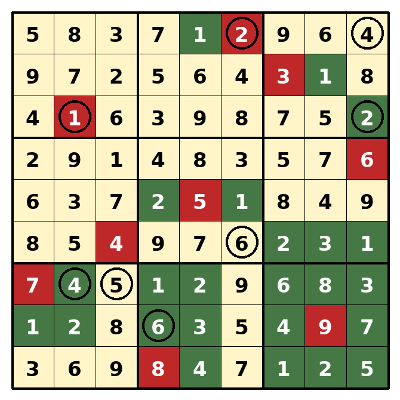

# Zombo Brainanas — generation findings (map #342, prototype #345)

**Question.** Can a Sudoku + gdc Infections + Choco Banana puzzle be generated
with several *clued brainanas* (uninfected, non-rectangular pockets holding a
circle whose digit is the pocket size), and what does the ruleset force?
Tooling: `zombo_brainanas_cpsat.py` (generator), `zombo_brainanas_render.py`
(picture). Claims are `[verified]` (we ran it) or `[unsure]`.

## Rules under test

Normal sudoku. Patient zero = digit equal to its box number, exactly one per
row and column, infected. Infected cells infect every orthogonally adjacent
smaller digit, to closure. **Zombo:** every connected infected group is a
rectangle. **Brainana:** every connected uninfected group is not. **Cluster:**
a circled digit equals the size of its own group. See the research notes
`infection-shading-model.md` and `choco-banana-propagation.md` for the
solver-side deductions.

## What the ruleset forces `[verified]`

- The 9 in box 9 infects all four neighbours, so it is never a rectangle
  corner away from the grid edge. Any genre that forbids adjacent shaded cells
  (Kuromasu, Hitori, Heyawake, Norinori) is impossible under infection.
- A rectangle's maximum digit is a patient zero. A cell bordering a rectangle
  is strictly larger than the infected cell it touches. A rectangle inside one
  box has size ≤ its patient zero's digit.
- Rectangles never touch side to side, only at corners: the infected set is a
  diagonal chain of rectangles, and a clued pocket is walled by that chain.
- The bare ruleset (no givens, no circles) has at least 30 solutions; it is
  constrained, not degenerate.
- **The role swap is infeasible.** Uninfected chocolate / infected bananas
  has no solution under these exact rules; CP-SAT proves it in under a second.
  Ablation: dropping the one-patient-zero-per-row rule alone makes it
  feasible, dropping the per-column rule does not. The asymmetry is the
  reading-order box numbering, which puts patient zeros 1–3 in the top band.
  No hand proof `[unsure]`.

## How to find grids with clued brainanas `[verified]`

Three approaches, in the order tried:

1. **Objective over bounding boxes** (maximise "some bounding box holds an
   enclosed pocket with a matching digit"): one clued brainana per grid even
   at 150 s, bound far from proven.
2. **Shading first, digits second** (draw a zombo/brainana-valid shading with
   pockets, then fill digits): fast to draw, but every pattern was unfillable.
   A shading that ignores where patient zeros can go is almost never realisable.
3. **Exact pocket placement in the joint model** — the one that works. A
   library of the fixed non-rectangular polyominoes of 3–MAX_POCKET cells
   (293 up to size 6, 1,051 up to size 7), each
   placement a boolean meaning "these cells uninfected, the whole border
   infected, one cell's digit equals the size"; require ≥ *k* placements.
   Two clued brainanas in ~70 s per seed, three on the first seed asked.

## Diversity `[verified]`

Random weights on digits alone converge on one shading with permuted digits
(seeds 200 and 201 had identical shading). The sampler now also puts random
weights on the shading and requires every new grid to differ from each earlier
grid in the batch by ≥ 12 cells (Hamming distance on infection status). A
two-pocket grid ≥ 12 cells from seed 0 exists.

**The pocket library's size cap matters.** With pockets capped at 6 cells,
CP-SAT proves no three-pocket grid exists ≥ 12 cells from seed 200's shading
(≥ 8 is feasible) — which looked like "three clued brainanas is one puzzle up
to small variations". Adding the 758 size-7 polyominoes (29,722 placements)
finds a three-pocket grid ≥ 12 cells away, pockets 4, 5 and 7, in 436 s on 16
threads (`zombo-brainanas/three_size7.json`). So the near-uniqueness was the
cap, not the ruleset. The generator's default cap is now 7; size 8–9 pockets
(2,725 and 9,910 shapes) are still uncovered.

## Stripping lessons `[verified]`

- **Cuts must be tagged by the circle they came from.** A lazy cut recorded
  because a circled pocket had the wrong size is only valid while that circle
  exists. Keeping it after the circle is dropped made a puzzle "unique" with
  4 givens that a fresh proof rejected.
- **A solver timeout is "not proved", never a crash.** The stripper keeps the
  given and moves on.
- **Never strip a banana circle.** Uniqueness rarely needs them, so a minimal
  strip deletes the feature the puzzle exists for. Rectangle circles and
  givens are fair game.
- A two-pocket grid is unique with 4 givens plus 5 rectangle circles
  (fresh-cuts proof). That is a minimum, not a setting: a 3-star puzzle keeps
  more.

## Example: seed 200, three clued brainanas

`zombo-brainanas/seed200_full.json`, rendered in `seed200.png` (green
infected, red patient zero, cream uninfected, circle = digit equals group
size). Pockets of 4 (top right), 5 (bottom left) and 6 (the elbow at r6c6).



```
uv run --with ortools docs/research/zombo_brainanas_cpsat.py hunt 200 240 900 out 1 3
python3 docs/research/zombo_brainanas_render.py out/full_200.json seed200.png
```

## gdc's clue kit across the series

Source: the four LMD puzzles found by the "Norma L. Dokes" search (tinyurl.com/normaldokes).

| Puzzle | Genre | Clues beyond patient zeros |
|---|---|---|
| Patient Zeroes, 000PUV | path | Microscopes on the path count infected cells among the surrounding 9. Kropki Tablets join consecutive uninfected digits. |
| Under the Microscope, 000PXK | Cave | Detector Cells: a blue-circled digit is uninfected and counts infected cells among its 8 neighbours. Germy Whispers join two infected digits differing by ≥5. Cocci Dots join consecutive uninfected digits. |
| Spill The Genes, 000Q02 | Nurikabe | Detector Cells. Cocci Dots join uninfected digits differing by the number of dots. |
| See The Symptoms, 000SDK | none, 6x6 | Internal X-Sums: a diamond digit is uninfected, counts uninfected digits seen in row and column (infected cells block), the number beside sums them. |

Patterns: every counting clue is pinned uninfected, so it is a shading given
first; every dot joins two uninfected digits. Our Cluster circle is neutral by
choice. A dot that carries a shading relation on both sides (white: consecutive
and same status; black: 1:2 and different status, which with the spread rule
forces the smaller digit infected and the larger not) would be new to the series.
Germy Whispers already covers the German-whisper half of the Renbanana idea.
